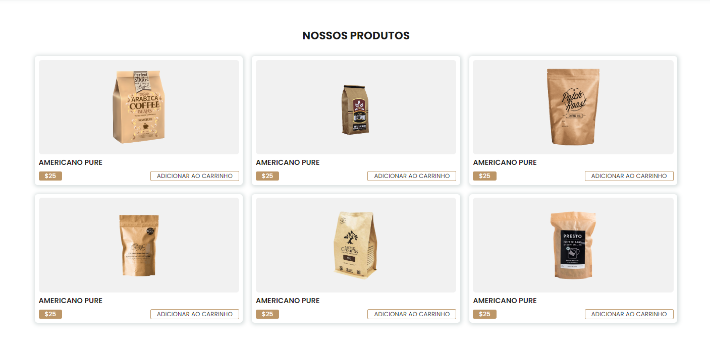

# Coffee Shop - Loja de Café

## Visão Geral
Este é um projeto de website para o Coffee Shop, uma loja online especializada na venda de café de alta qualidade. O site foi construído com HTML, CSS e JavaScript, oferecendo uma experiência envolvente para os amantes de café que desejam explorar e comprar diferentes tipos de café.

## Características Principais
- **Design Atraente**: O design do website é inspirado no ambiente acolhedor de uma cafeteria, criando uma experiência de compra agradável para os clientes.
- **Catálogo de Café**: Apresenta um catálogo abrangente de café, incluindo diferentes tipos de grãos, blends e regiões de origem..
- **Avaliações de Clientes**: Apresenta avaliações e comentários de clientes para ajudar os usuários a tomar decisões informadas sobre suas compras.

## Tecnologias Utilizadas
- **HTML**: Utilizado para estruturar o conteúdo do website.
- **CSS**: Responsável pelo estilo e design visual do site.
- **JavaScript**: Adiciona interatividade.

## Funcionalidades

- Página inicial com banner apresentando imagem de um copo de café.
- Menu de navegação com links para diferentes seções do site.
- Seção sobre, com informações sobre nossa história.
- Seção deprodutos, com fotos e descrições dos tipos de cafés disponiveis.
- Seção de cliente, com nomes e avaliações do nossos clientes.
- Rodapé com informações de copyright e links para redes sociais

## Estrutura de Arquivos

├──📁 assets/  
│    └── 📁 img/  
│        ├──🖼️about.jpg  
│        ├──🖼️ logo.jpg  
│        └──🖼️... (Outras imagens)  
├──📁 css  
│    └── 📄style.css  
├──📁 js  
│    └──📄 script.js  
├──📄 index.html  

## Capturas de Tela

*Página inicial com uma imagem convidativa.*

*Página com diferentes tipos de café.*

## Demonstração
Acesse o site demo do projeto em https://coffee-shop-pied.vercel.app/

## Como Contribuir
Se você é um entusiasta de café ou um desenvolvedor web, sinta-se à vontade para contribuir com este projeto. Basta clonar o repositório, fazer as alterações desejadas e enviar uma solicitação de pull.

## Licença
Este projeto é licenciado sob a [Licença MIT](https://opensource.org/licenses/MIT).
